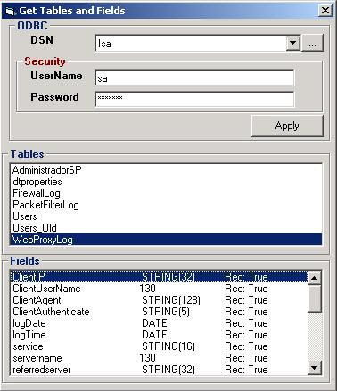



## Retrieve Tables and Column From ODBC \(VB\)

### Description

This program retrieve the tables and column existing from DSN ODBC. To do, use the OpenSchema method frmo ADO.
 
### More Info
 
ODBC DSN

Tables and columns used

             |
---                |---
**Submitted On**   |2001-12-14 15:56:00
**By**             |[Omar Vivas](https://github.com/Planet-Source-Code/PSCIndex/blob/master/ByAuthor/omar-vivas.md)
**Level**          |Intermediate
**User Rating**    |4.8 (24 globes from 5 users)
**Compatibility**  |VB 6\.0
**Category**       |[Databases/ Data Access/ DAO/ ADO](https://github.com/Planet-Source-Code/PSCIndex/blob/master/ByCategory/databases-data-access-dao-ado__1-6.md)
**World**          |[Visual Basic](https://github.com/Planet-Source-Code/PSCIndex/blob/master/ByWorld/visual-basic.md)
**Archive File**   |[Retrieve\_T4214012142001\.zip](https://github.com/Planet-Source-Code/omar-vivas-retrieve-tables-and-column-from-odbc-vb__1-29782/archive/master.zip)

